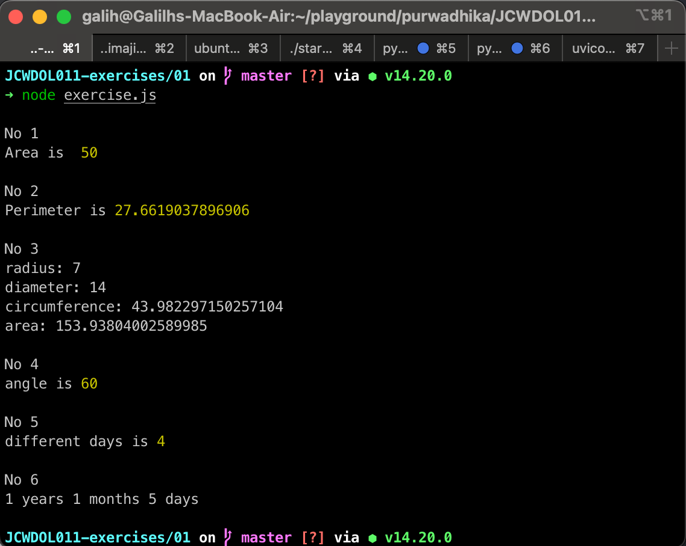

# Excercise 01

## Write a code to find area of rectangle.
```js
// No 1

const length = 10;
const width = 5;

const area = length * width;
console.log("\nNo 1")
console.log("Area is ",area);
```
## Write a code to find perimeter of rectangle.
```js
// No 2
const height= 10;

const width_2 = 6;

const side = Math.sqrt(height**2 + width_2**2);
const perimeter = height + width_2 + side;
console.log("\nNo 2")
console.log("Perimeter is",perimeter);
```
## Write a code to find diameter, circumference and area of a circle.
```js
// No 3
const r = 7;
const d = 2 * r;
const circumference = Math.PI * d;
const areaCircular = Math.PI * r**2;

console.log("\nNo 3")
console.log('radius: ' + r);
console.log('diameter: ' + d);
console.log('circumference: ' + circumference);
console.log('area: ' + areaCircular);
```
## Write a code to find angles of triangle if two angles are given.
```js
// No 4
const ANGLE_1 = 60;
const ANGLE_2 = 60;

const ANGLE_3 = 180 - (ANGLE_1 + ANGLE_2);
console.log("\nNo 4")
console.log('angle is',ANGLE_3);

```
## Write a code to get difference between dates in days.
```js
// No 5

const date_1 = new Date('2023-07-24')
const date_2 = new Date('2023-07-20')

const differentDays = Math.abs(date_1 - date_2) / (1000 * 60 * 60 * 24);

console.log("\nNo 5")
console.log('different days is',differentDays);
```
## Write a code to convert days to years, months and days.
```js
// No 6

const days = 400;

const year = Math.floor(days / 365);
const month = Math.floor((days % 365) / 30);
const day = Math.floor((days % 365) % 30);

console.log("\nNo 6")
console.log(year + ' years ' + month + ' months ' + day + ' days');

```

## Result

