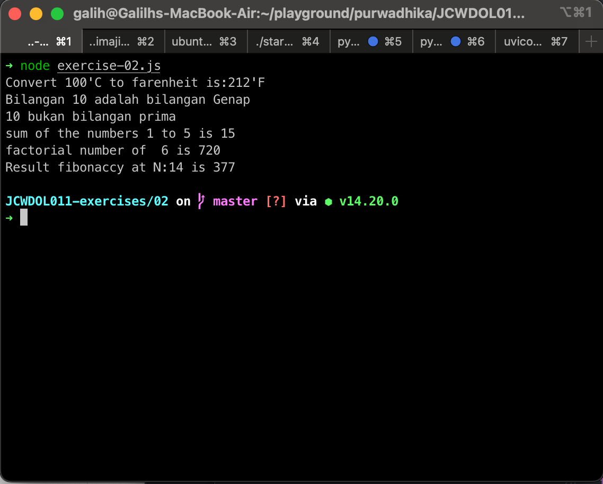

# Excercise 01
## Write a code to convert celsius to fahrenheit.
```js

const tempareture_in_c = 100;

const result = (tempareture_in_c * 9 / 5) + 32;

console.log(`Convert ${tempareture_in_c}'C to farenheit is:${result}'F`)
```
## Write a code to check whether the number is odd or even
```js

const number = 10

let oddOrEven = ''
if (number % 2 === 0) {
    oddOrEven = 'Genap'
} else {
    oddOrEven = 'Ganjil'
}

console.log(`Bilangan ${number} adalah bilangan ${oddOrEven}`)
```
## Write a code to check whether the number is prime number or not
```js

const number3 = 10
let isPrime = true

for (let i = 2; i < number3; i++) {
    if (number3 % i === 0) {
        isPrime = false
    }
}

if (isPrime) {
    console.log(`${number3} adalah bilangan prima`)
} else {
    console.log(`${number3} bukan bilangan prima`)
}
```
## Write a code to find the sum of the numbers 1 to N.
```js

const number4 = 5

let sumNumber = 0

for (let i = 1; i <= number4; i++) {
    sumNumber += i
}
console.log(`sum of the numbers 1 to ${number4} is ${sumNumber}`)
```
## Write a code to find factorial of a number.
```js

const number5 = 6

let factorialNumber = 1
if (number5 === 0) {
    console.log(`factorial number of  ${number5} is 1`)
} else {
    for (let i = 1; i <= number5; i++) {
        factorialNumber *= i
    }
    console.log(`factorial number of  ${number5} is ${factorialNumber}`)
}
```
## Write a code to print the first N fibonacci numbers.
```js
/*
n   =   0	1	2	3	4	5	6	7	8	9	10	11	12	13	14	...
x n =	0	1	1	2	3	5	8	13	21	34	55	89	144	233	377	...
*/
const N_FIBONACCY = 14
let currentResult = 1
let lastResult = 0
if (N_FIBONACCY === 0) {
    console.log(`Result fibonaccy at N:${N_FIBONACCY} is ${0}`)
} else {
    for (let i = 0; i < N_FIBONACCY - 1; i++) {
        const tempLastResult = currentResult
        currentResult = lastResult + currentResult
        lastResult = tempLastResult
    }

    console.log(`Result fibonaccy at N:${N_FIBONACCY} is ${currentResult}`)
}
```

## Result

