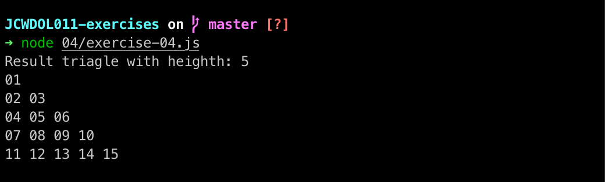
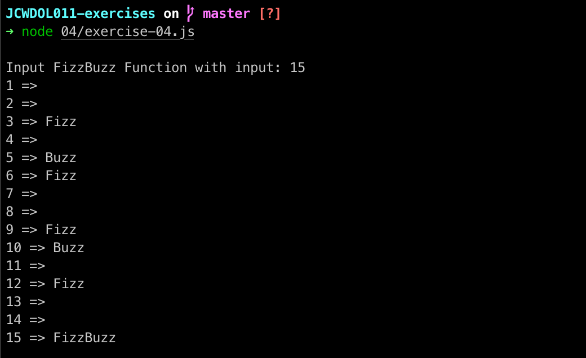
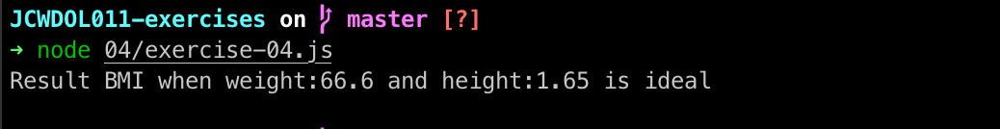
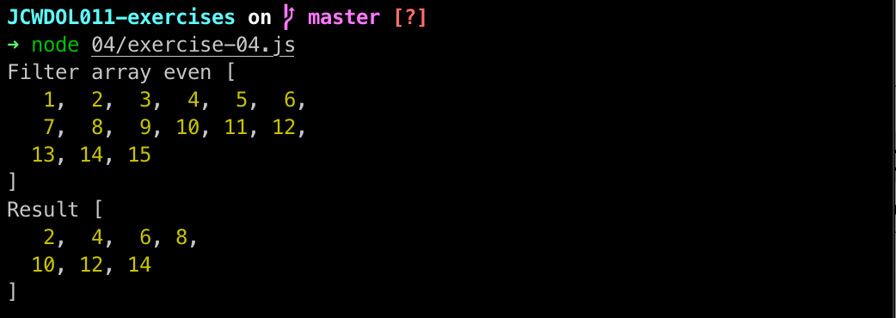
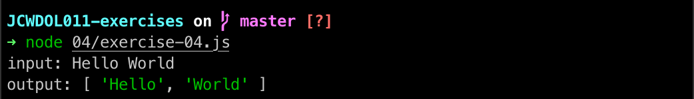

# Exercise Array and Function

## Exercise 1

```js
function printTriangle(height) {
    let currentNumber = 1
    for (let level = 1; level <= height; level++) {
        let tempResult = ""
        for (let column = 0; column < level; column++) {
            tempResult += `${String(currentNumber).padStart(2, 0)} `
            currentNumber++
        }
        console.log(tempResult)
    }


}
const height = 5
console.log(`Result triagle with heighth: ${height}`)
printTriangle(5)
```


## Exercise 2

```js
function fizzBuzz(n) {
    for (let index = 1; index <= n; index++) {
        let result = ""
        if (index % 3 === 0) {
            result += "Fizz"
        }
        if (index % 5 === 0) {
            result += "Buzz"
        }
        console.log(`${index} => ${result}`)
    }

}
const inputFizzBuzz = 15
console.log(`\nInput FizzBuzz Function with input: ${inputFizzBuzz}`)
fizzBuzz(inputFizzBuzz)
```


## Exercise 3 - Create a function to calculate Body Mass Index (BMI)

```js
function checkBMI(weight, height) {
    const indexBMI = weight / height ** 2
    if (indexBMI < 18.5)
        return "less weight"
    if (indexBMI >= 18.5 && indexBMI <= 24.9)
        return "ideal"
    if (indexBMI >= 25 && indexBMI <= 29.9)
        return "overweight"
    if (indexBMI >= 30 && indexBMI <= 39.0)
        return "very overweight"
    if (indexBMI > 39.9)
        return "obesity"
}
const weight = 66.6 //kg
const bodyHeight = 1.65 //meter
const resultBMI = checkBMI(weight, bodyHeight)
console.log(`Result BMI when weight:${weight} and height:${bodyHeight} is ${resultBMI}`)
```


## Exercise 4

```js
function removeOddNumberInArray(inputArray) {
    return inputArray.filter((element) => element % 2 === 0);
}
const inputArray = [1, 2, 3, 4, 5, 6, 7, 8, 9, 10, 11, 12, 13, 14, 15];
const resultExercise4 = removeOddNumberInArray(inputArray);
console.log("Filter array even", inputArray);
console.log("Result", resultExercise4);
```


## Exercise 5

```js
const splitSentence = (sentence) => {
    return sentence.split(" ")
}
const inputSentence = "Hello World"
const resultExercise5 = splitSentence(inputSentence)
console.log(`input: ${inputSentence}`)
console.log('output:', resultExercise5)
```
