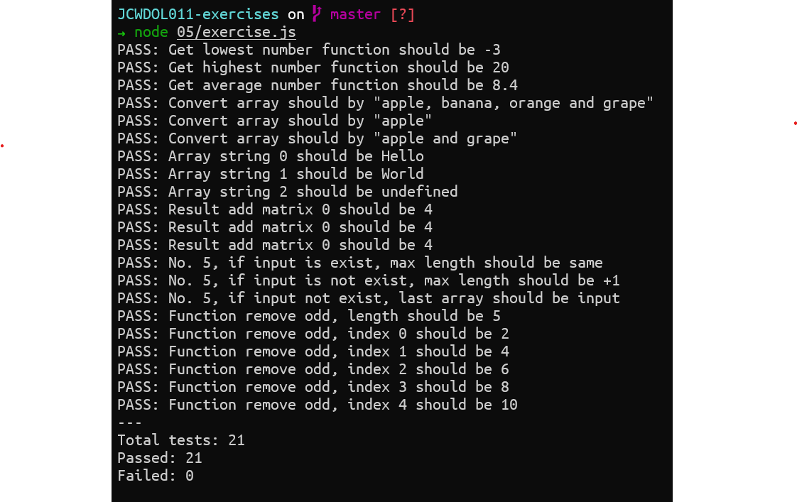

# Readme Exercise Day 5

## Exercise 1

```js
function getLowestNumber(listNumber) {
    let lowestNumber = null
    for (let index = 0; index < listNumber.length; index++) {
        if (index === 0)
            lowestNumber = listNumber[0]
        else if (lowestNumber > listNumber[index])
            lowestNumber = listNumber[index]
    }
    return lowestNumber || 0
}

function getHighestNumber(listNumber) {
    let highestNumber = null
    for (let index = 0; index < listNumber.length; index++) {
        if (index === 0)
            highestNumber = listNumber[0]
        else if (highestNumber < listNumber[index])
            highestNumber = listNumber[index]
    }
    return highestNumber || 0
}

function getAverage(listNumber) {
    let average = 0
    let sumNumber = 0
    for (let index = 0; index < listNumber.length; index++) {
        sumNumber += listNumber[index]
    }
    average = sumNumber / listNumber.length
    return average || 0
}
```

## Exercise 2

```js
function convertArraytoString(listString) {
    let result = ''
    for (let index = 0; index < listString.length; index++) {
        if (index === 0)
            result += listString[index]
        else if (index === listString.length - 1)
            result += ` and ${listString[index]}`
        else
            result += `, ${listString[index]}`
    }
    return result
}
```

## Exercise 3

```js
function splitString(inputString) {
    let result = []

    const length = inputString.length
    let tempWord = ""
    for (let index = 0; index < length; index++) {

        if (index === length - 1) {
            tempWord += inputString[index]
            result.push(tempWord)
        }
        else if (inputString[index] === " ") {
            result.push(tempWord);
            tempWord = ""
        }
        else
            tempWord += inputString[index]
    }
    return result
}
```

## Exercise 4

```js
function addMatrix(matrixA, matrixB) {
    const lengthMatrixA = matrixA.length
    const lengthMatrixB = matrixB.length

    if (lengthMatrixA !== lengthMatrixB) {
        console.log("[ERROR] Matrix length is not same")
        return
    }

    let result = []
    for (let index = 0; index < lengthMatrixA; index++) {
        result.push(matrixA[index] + matrixB[index])
    }

    return result
}
```

## Exercise 5

```js
function addUniqItem(inputArray, newItem) {
    const length = inputArray.length
    for (let index = 0; index < length; index++) {
        if (newItem === inputArray[index]) {
            return inputArray
        }
    }
    inputArray.push(newItem)
    const result = inputArray
    return result
}
```

## Exercise 6

```js
function removeOddNumberInArray(inputArray) {
    let result = []
    const length = inputArray.length
    for (let index = 0; index < length; index++) {
        if (inputArray[index] % 2 === 0) {
            result.push(inputArray[index])
        }
    }
    return result
}
```

