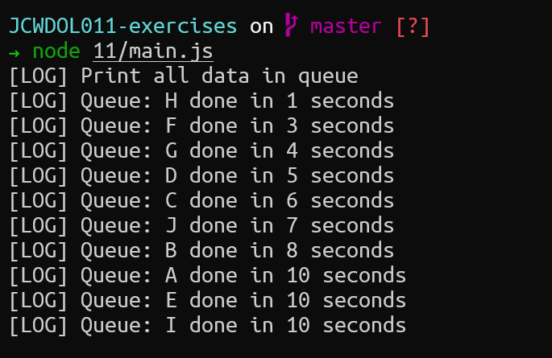

# Exercise 11

## Code
> queue.js
```js
class Queue {
  constructor() {
    this.queue = [];
  }

  enqueue(item) {
    this.queue.push(item);
  }

  dequeue() {
    return this.queue.shift();
  }

  run() {
    console.log(`[LOG] Print all data in queue`);
    while (this.queue.length > 0) {
      const item = this.dequeue();
      const delay = Math.floor(Math.random() * 10) + 1;
      setTimeout(() => {
        console.log(`[LOG] Queue: ${item} done in ${delay} seconds`);
      }, delay * 1000);
    }
  }

  get size() {
    return this.queue.length;
  }
}

module.exports = Queue;
```

> main.js
```js
const queue = require("./queue");

const q = new queue();

q.enqueue("A");
q.enqueue("B");
q.enqueue("C");
q.enqueue("D");
q.enqueue("E");
q.enqueue("F");
q.enqueue("G");
q.enqueue("H");
q.enqueue("I");
q.enqueue("J");

q.run();
```

## Result
